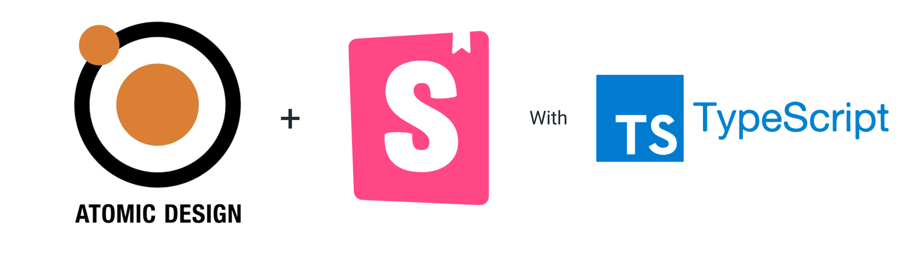

# Atomic Book 🦄 🎨 ⚛️ 📖



[![Contributors][contributors-shield]][contributors-url]
[![Forks][forks-shield]][forks-url]
[![Stargazers][stars-shield]][stars-url]
[![Issues][issues-shield]][issues-url]
[![MIT License][license-shield]][license-url]

# Installation

```
npm install atomic-book
```

# Usage

```Typescript
import Typo, { TypoTypes } from 'atomic-book/atoms/Typo'

export default ({ title }) => {
  return (
    <Typo type={TypoTypes.StandardTitle}>
      {title}
    </Typo>
  )
}
```

# Development

Start the storybook and developing new component
```
// Clone the project
atomic-book > npm install
atomic-book > npm start
```

## Build

```
npm build
```

After you built successfully, 2 things are done:
- Atoms, Molecules and Organism components are compiled to JS and located in Dist
- A css fils is also generated by combinding all css of all existing components in Atomic Book.

# Getting Helps

Contact us at `open@shopback.com`

# Contributing

Contributions are what make the open source community such an amazing place to be learn, inspire, and create. Any contributions you make are greatly appreciated.

1. Fork the Project
2. Create your Feature Branch (git checkout -b feature/AwesomeComponent)
3. Commit your Changes (git commit -m 'Add some AwesomeComponent')
4. Push to the Branch (git push origin feature/AwesomeComponent)
5. Open a Pull Request


<p style="text-align: center;margin-top: 36px">
  I forked a bit chunk from <a href="https://github.com/jmlivingston/react-components-library">jl-react-components-library</a>, adding some Typescript spcies and cook it to more atomic.
</p> 

<!-- MARKDOWN LINKS & IMAGES -->
<!-- https://www.markdownguide.org/basic-syntax/#reference-style-links -->
[contributors-shield]: https://img.shields.io/github/contributors/poepanda/atomic-book.svg?style=for-the-badge
[contributors-url]: https://github.com/poepanda/atomic-book/graphs/contributors
[forks-shield]: https://img.shields.io/github/forks/poepanda/atomic-book.svg?style=for-the-badge
[forks-url]: https://github.com/poepanda/atomic-book/network/members
[stars-shield]: https://img.shields.io/github/stars/poepanda/atomic-book.svg?style=for-the-badge
[stars-url]: https://github.com/poepanda/atomic-book/stargazers
[issues-shield]: https://img.shields.io/github/issues/poepanda/atomic-book.svg?style=for-the-badge
[issues-url]: https://github.com/poepanda/atomic-book/issues
[license-shield]: https://img.shields.io/github/license/poepanda/atomic-book.svg?style=for-the-badge
[license-url]: https://github.com/poepanda/atomic-book/blob/master/LICENSE
